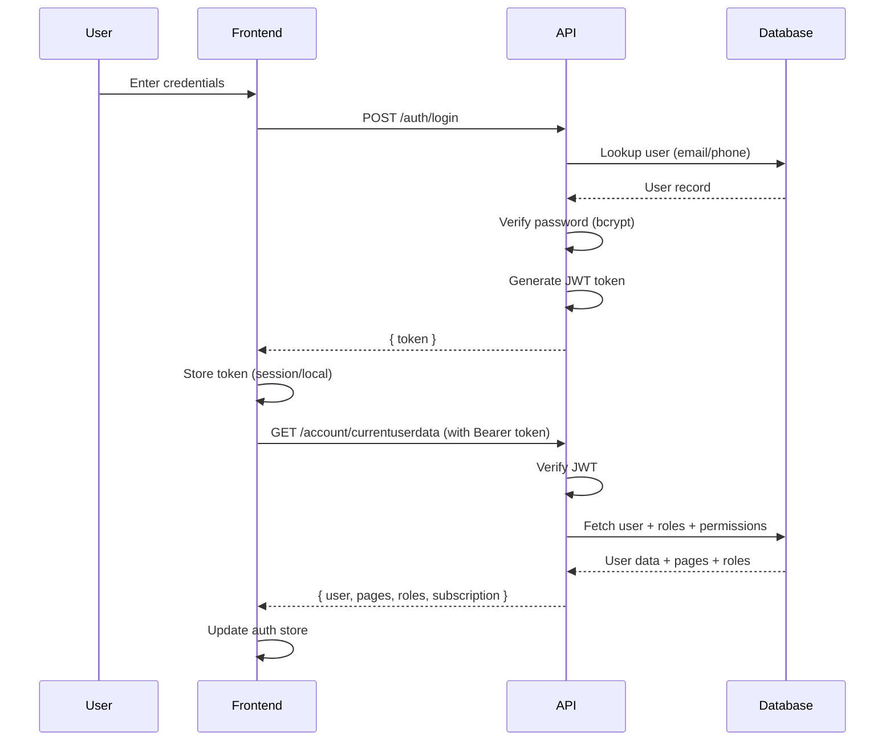
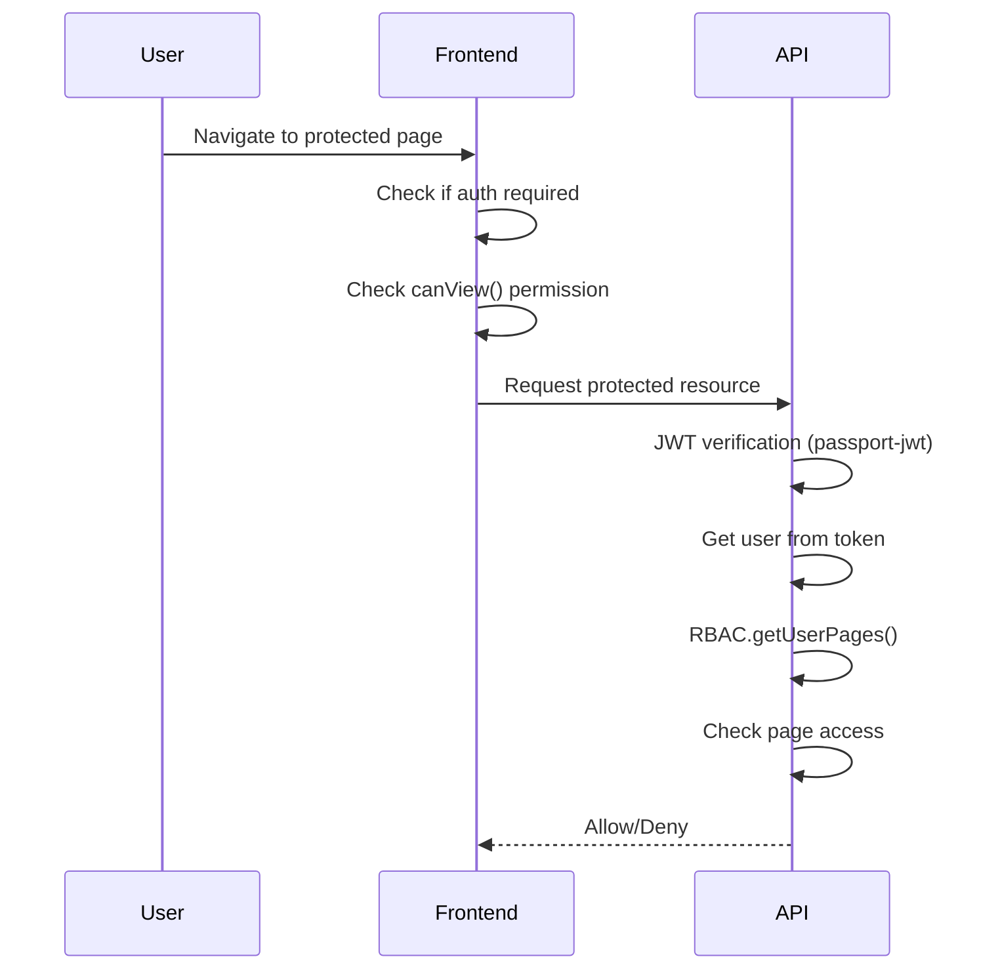

# Authentication & Authorization Analysis

## Executive Summary

This document provides a detailed analysis of the authentication and authorization patterns implemented in the Dads Bookshelves (DBS) system, which consists of a Node.js/Express backend API and a Quasar/Vue.js frontend.

---

## Backend Authentication & Authorization

### Authentication Pattern

#### 1. JWT-Based Token Authentication

The system uses **JSON Web Tokens (JWT)** for stateless authentication.

| Component | Implementation |
|-----------|---------------|
| **Token Type** | Bearer Token (JWT) |
| **Library** | `passport-jwt` + `jsonwebtoken` |
| **Token Secret** | Stored in [`config.js`](API/config.js:14) as `auth.apiTokenSecret` |
| **Password Reset Secret** | Stored as `auth.userTokenSecret` |
| **Token Expiry** | 45,000 minutes (~31 days) for API tokens |
| **Password Reset Token Expiry** | 10 minutes |

**Key Files:**
- [`API/controllers/auth.js`](API/controllers/auth.js) - Authentication endpoints
- [`API/helpers/passport-auth.js`](API/helpers/passport-auth.js) - Passport JWT strategy

#### 2. Login Flow

```
POST /auth/login
├── Input: { username, password }
├── Username lookup: email OR telephone
├── Password verification: bcrypt.compareSync()
└── Response: { token }
```

**Code Reference:** [`auth.js` lines 20-45](API/controllers/auth.js:20)

#### 3. Password Security

| Feature | Implementation |
|---------|---------------|
| **Hashing Algorithm** | bcrypt (default) |
| **Alternative** | SHA-256 (configurable) |
| **Verification** | [`utils.passwordVerify()`](API/helpers/utils.js:252) |

**Code Reference:** [`API/helpers/utils.js` lines 242-259](API/helpers/utils.js:242)

#### 4. Registration Flow

```
POST /auth/register
├── Input validation: name, email, password, telephone
├── Password hashing: utils.passwordHash()
├── Role assignment: 'client' role (default)
├── Duplicate checks: name, email
└── Response: { token }
```

**Code Reference:** [`auth.js` lines 53-93](API/controllers/auth.js:53)

#### 5. Password Reset Flow

```
POST /auth/forgotpassword
├── Input: { email }
├── Generate JWT token (10min expiry)
├── Send reset email with token link
└── Response: "We have emailed your password reset link!"

POST /auth/resetpassword
├── Input: { token, password, confirm_password }
├── Verify JWT token
├── Hash new password
└── Update user record
```

**Code Reference:** [`auth.js` lines 106-167](API/controllers/auth.js:106)

#### 6. Google OAuth Integration

The system supports Google OAuth 2.0 for social login:

| Feature | Implementation |
|---------|---------------|
| **Authorization URL** | [`googleAuthMethods.generateGoogleOAuthUrl()`](API/helpers/googleAuthMethods.js:11) |
| **Token Exchange** | [`exchangeCodeForTokens()`](API/helpers/googleAuthMethods.js:20) |
| **User Profile** | [`fetchUserProfile()`](API/helpers/googleAuthMethods.js:36) |

---

### Authorization Pattern

#### 1. Role-Based Access Control (RBAC)

The system implements **RBAC** with the following roles:

| Role | Description |
|------|-------------|
| `admin` | Full system access |
| `user` | Standard user |
| `client` | Client/customer |
| `developer` | Developer access |
| `publisher` | Publisher access |
| `marketer` | Marketer access |

**Key Files:**
- [`API/helpers/rbac.js`](API/helpers/rbac.js) - RBAC implementation
- [`API/helpers/auth_middleware.js`](API/helpers/auth_middleware.js) - Middleware

#### 2. RBAC Implementation

The RBAC system uses a **permissions table** to store role-specific page access:

```javascript
// rbac.js lines 23-38
async getUserPages() {
  const query = {
    where: { role_id: this.userRoleId },
    attributes: ["permission"],
  };
  const records = await DB.Permissions.findAll(query);
  this.userPages = records.map((e) => e.permission);
}
```

#### 3. Access Control Levels

| Constant | Value | Description |
|----------|-------|-------------|
| `AUTHORIZED` | "authorized" | Access granted |
| `FORBIDDEN` | "forbidden :access denied" | Access denied |
| `UNKNOWN_ROLE` | "unknown_role" | Role not recognized |

#### 4. Public Pages (Whitelist)

The following pages are accessible without authentication:

```
auth, components_data, fileuploader, s3uploader, publish, ebook,
dbslibrary, sellbooks, limitlessintiative, dbspricelist, donation,
googlecallback, about_limitless, archive, signin, getinvolved,
privacy, terms, books/view, books/shop, consents/add, currentsliders,
donations/add, featuredbooks, libraryaccess, newslettersubscriptions/add,
ebookuploader/edit, ebookuploader/add, ebook-conversion, ebookuploader/view,
ebookpricing, user-home, ebookpayments/add, darsboard,
dslibrarypayments/callback, mainlibrary, userdevices/register,
books/download, campaigns/validate, affiliatelinks/track
```

**Code Reference:** [`auth_middleware.js` lines 5-46](API/helpers/auth_middleware.js:5)

#### 5. Middleware Chain

The auth middleware performs these checks:

1. Check if user is authenticated
2. Load user's role and permissions
3. Determine page access level (AUTHORIZED/FORBIDDEN/UNKNOWN_ROLE)
4. Set role-specific flags (`isAdmin`, `isUser`, `isClient`, etc.)
5. Allow/deny access based on page access

**Code Reference:** [`auth_middleware.js` lines 56-114](API/helpers/auth_middleware.js:56)

---

## Frontend Authentication & Authorization

### Authentication Pattern

#### 1. Token Storage

The frontend uses **dual storage** for tokens:

| Storage Type | Usage |
|--------------|-------|
| **sessionStorage** | Default (session-only) |
| **localStorage** | When "remember me" is checked |

**Key Files:**
- [`FRONTEND/src/services/storage.js`](FRONTEND/src/services/storage.js) - Storage service

```javascript
// storage.js lines 26-33
saveLoginData(loginData, remember) {
  let token = loginData.token;
  if(remember){
    localStorage.setItem(TOKEN_KEY, token);
  }
  else{
    sessionStorage.setItem(TOKEN_KEY, token);
  }
}
```

#### 2. API Client Configuration

| Component | Implementation |
|-----------|---------------|
| **HTTP Client** | Axios |
| **Base URL** | `process.env.API_PATH` |
| **Authorization Header** | `Bearer ${token}` |
| **Token Persistence** | Global axios default header |

**Key Files:**
- [`FRONTEND/src/services/api.js`](FRONTEND/src/services/api.js) - API service
- [`FRONTEND/src/boot/axios.js`](FRONTEND/src/boot/axios.js) - Axios boot

**Code Reference:** [`api.js` lines 8-11](FRONTEND/src/services/api.js:8)

#### 3. Authentication Store

The frontend uses **Pinia** for state management:

| State | Description |
|-------|-------------|
| `user` | Current user object |
| `userRole` | User's role name |
| `userPages` | Array of permitted pages |

**Key Files:**
- [`FRONTEND/src/stores/auth.js`](FRONTEND/src/stores/auth.js) - Auth store

#### 4. AuthComposable

The system uses Vue composables for authentication logic:

**Key Files:**
- [`FRONTEND/src/composables/auth.js`](FRONTEND/src/composables/auth.js) - Auth composable

| Function | Purpose |
|----------|---------|
| `getUserData()` | Fetch user data and permissions |
| `login()` | Perform login |
| `logout()` | Clear session |
| `saveLoginData()` | Store token |

#### 5. Boot Authentication

The auth boot file sets up router guards:

**Key Files:**
- [`FRONTEND/src/boot/auth.js`](FRONTEND/src/boot/auth.js) - Auth boot

```javascript
// boot/auth.js lines 11-37
router.beforeEach((to, from, next) => {
  const user = auth.user;
  let authRequired = auth.pageRequiredAuth(path);
  if (authRequired) {
    if(!user){
      return next({ path: '/', query: { nexturl: to.fullPath } });
    }
    if (!auth.canView(path)) {
      return next({path: "/error/forbidden"});
    }
  }
  next();
});
```

---

### Authorization Pattern (Frontend)

#### 1. Route Guards

The frontend implements **client-side route protection**:

```javascript
// composables/auth.js lines 155-158
const pageRequiredAuth = function (path) {
  const { pageName, routePath } = utils.parseRoutePath(path)
  return !publicPages.includes(pageName) && !publicPages.includes(routePath)
}
```

#### 2. Page Access Check

```javascript
// composables/auth.js lines 160-168
const canView = function (path) {
  if (path) {
    let { routePath } = utils.parseRoutePath(path)
    const userPages = store.state.userPages
    return publicPages.includes(routePath) || userPages.includes(routePath)
  }
  return true
}
```

#### 3. Role-Based UI Controls

The frontend defines **role abilities** for UI-level control:

```javascript
// composables/auth.js lines 55-84
const roleAbilities = {
  admin: [
    'dslibrarypayments/edit',
    'dslibrarypayments/delete',
    // ... more permissions
  ],
  user: [],
  client: [],
  developer: [
    'dslibrarypayments/edit',
    // ... more permissions
  ],
  publisher: [],
}
```

#### 4. Public Pages (Frontend)

The frontend maintains its own list of public routes:

```javascript
// composables/auth.js lines 4-54
const publicPages = [
  '/', 'index', 'error', 'publish', 'ebook', 'dbslibrary',
  'sellbooks', 'limitlessintiative', 'dbspricelist', 'donation',
  // ... more pages
]
```

#### 5. Role Checks

Helper functions for role-based UI rendering:

```javascript
// composables/auth.js lines 187-195
const isAdmin = userRole.toLowerCase() == 'admin'
const isUser = userRole.toLowerCase() == 'user'
const isClient = userRole.toLowerCase() == 'client'
const isDeveloper = userRole.toLowerCase() == 'developer'
const isPublisher = userRole.toLowerCase() == 'publisher'
```

---

## Data Flow Diagrams

### Authentication Flow



### Authorization Flow



---

## Security Considerations

### Strengths

1. **Stateless Authentication**: JWT provides scalable, stateless session management
2. **Secure Password Storage**: bcrypt hashing with salt
3. **Dual Storage Option**: Session vs persistent login
4. **Server-Side RBAC**: Authorization is enforced on the backend
5. **Token Expiration**: API tokens expire after 31 days
6. **Password Reset Tokens**: Short-lived (10 min) tokens for reset operations
7. **Role-Based Flags**: Easy server-side role checks

### Potential Improvements

1. **Token Refresh Mechanism**: No visible refresh token implementation
2. **HTTPS Only**: Should enforce HTTPS in production
3. **Rate Limiting**: No rate limiting on auth endpoints visible
4. **Account Lockout**: No failed login attempt lockout
5. **Multi-Factor Authentication**: Not implemented
6. **CSRF Protection**: Not explicitly visible in the code
7. **Role Admin UI**: No visible admin interface for managing roles/permissions in the frontend

---

## Summary

| Aspect | Backend | Frontend |
|--------|---------|----------|
| **Auth Method** | JWT (Bearer Token) | JWT (Bearer Token) |
| **Password Hash** | bcrypt | N/A |
| **Authorization** | RBAC (database-driven) | RBAC + route guards |
| **State Management** | N/A | Pinia store |
| **Public Pages** | Whitelist array | Whitelist array |
| **Roles** | 6 roles | 5 roles + abilities |
| **Token Storage** | N/A | sessionStorage/localStorage |
| **OAuth** | Google OAuth 2.0 | Google OAuth 2.0 |

---

*Analysis Date: 2026-03-18*
*Project: Dads Bookshelves (DBS)*
